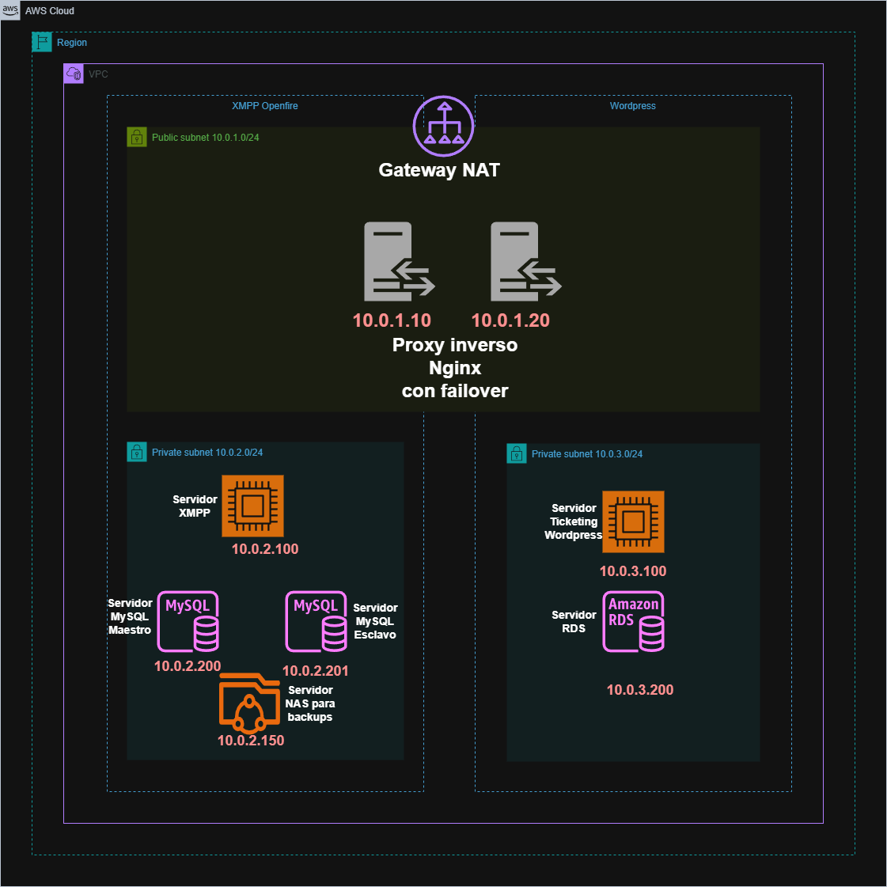

# :shipit: MensAGL Equipo4(5) :shipit: 
 


#  💀 Reto ASIR2 2024-25 - Mensagl 💀 

## :memo: Descripción :memo:
El reto Mensagl tiene como objetivo la implementación de un servicio de mensajería instantánea y comunicaciones unificadas, alojado en la nube de AWS. Además, se integrará un sistema de ticketing para la gestión de usuarios y soporte técnico mediante un plugin de wordpress.

## :sparkles: Objetivos :sparkles:
- Analizar tecnologías de comunicaciones unificadas y mensajería instantánea. 
- Comparar diferentes soluciones de código abierto.
- Implementar una infraestructura basada en AWS.
- Configurar un sistema de ticketing para la gestión de usuarios.
- Documentar y presentar el proyecto final.

## :rocket: Tecnologías Utilizadas :rocket:
- **Cloud Computing**: Amazon Web Services (AWS). ✅
- **Protocolos de Mensajería**: XMPP y TURN. ✅
- **Bases de Datos**: MySQL. ✅
- **Seguridad**: TLS, cortafuegos, backups mediante rsync. ✅
- **Automatización**: Terraform, AWS CLI, scripts en Bash. ✅

## 🚧 Arquitectura 🚧
 
- **Red en la nube (AWS)** VPC. ☁️
- **Servidores de Mensajería y Ticketing** en diferentes subredes. 🔒️
- **Proxy Inverso** para el balanceo de carga gestion de certificados y dominios. 🔐
- **Gestión de Usuarios** mediante un sistema de ticketing. 🏷️
- **Federación** entre servidores de equipos. 📱

## :trollface: Instalación y Despliegue :trollface:
1. Clonar el repositorio:  
   ```bash
   git clone https://github.com/amazona01/AWSCLI
   cd AWSCLI/configuraciones_terraform
   ```
2. Cambiar el nombre del alumno en el script de terraform
3. Cambiar los dominios utilizados en nginx.sh
4. Configurar Terraform e iniciar la infraestructura.
5. Comprobar conectividad y funcionalidad.

## 📮 Contacto 📮
Para más información, contacta con los administradores del repositorio o consulta la documentación en el repositorio.

---
👷Proyecto desarrollado por estudiantes de ASIR2, curso 2024-25 👷. 

